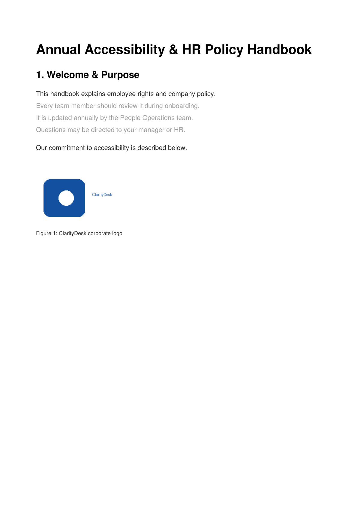
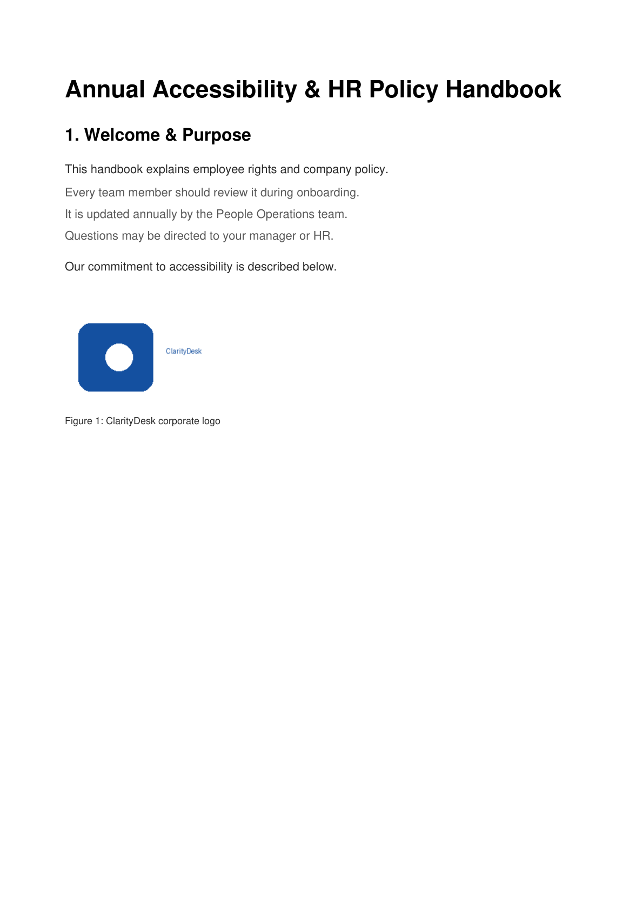

# ClarityDesk

**Multi-agent WCAG/ADA accessibility auditor & remediator for small-business documents.**

Small businesses, schools, and nonprofits publish hundreds of customer- and
employee-facing PDFs — handbooks, policies, slide decks — that quietly fail basic
accessibility standards (no alt text, low contrast, untagged headings, no
document language). That's a fast-growing **ADA / Section 508 legal risk**, yet
there's almost no affordable self-serve tooling built for organizations this size.

ClarityDesk is an agentic pipeline that **scans** a document for WCAG violations,
**remediates** them with context-aware fixes, and **verifies** every fix against
the exact rule it was meant to satisfy — a clean *plan → act → verify* loop.

---

## The result in one picture

| Before — 18 violations | After — 0 violations |
|---|---|
|  |  |

```
Violations: 18 → 0  (PASS)
Independent re-scan of the saved output: 0 violations
```

A full compliance report is generated in JSON, Markdown, and a shareable HTML
page (see [`demo/showcase/`](demo/showcase/)).

---

## Why agents

Accessibility remediation isn't a single transform — each violation needs a
*decision*:

1. **Plan** — the Scanning Agent parses document structure and flags *what* is
   wrong and *why* (mapped to a specific WCAG Success Criterion).
2. **Act** — the Remediation Agent generates a *real* fix: alt text written from
   the image's content + surrounding caption (not a `"image"` placeholder),
   heading tags, an outline, a darkened-to-spec colour.
3. **Verify** — the Verification Agent re-runs the same checks on the output and
   only passes when the violation is actually gone. Fixes are never trusted blind.

## Architecture

```
                ┌─────────────────────────────────────────────┐
                │              Orchestrator                     │
                │     plan → act → verify  (security sandbox)   │
                └───────┬───────────────┬──────────────┬───────┘
                        │               │              │
            ┌───────────▼──┐   ┌────────▼───────┐  ┌───▼─────────────┐
            │ Scanning     │   │ Remediation    │  │ Verification    │
            │ Agent        │──▶│ Agent          │─▶│ Agent           │
            │ flags WCAG   │   │ generates real │  │ re-checks each  │
            │ violations   │   │ fixes          │  │ fix vs its rule │
            └──────────────┘   └────────────────┘  └─────────────────┘
                        │               │              │
                        └───────────────┴──────────────┘
                                        │
                              ┌─────────▼─────────┐
                              │   MCP Server      │  compliance-report
                              │ (FastMCP, stdio)  │  endpoint for a CMS,
                              └───────────────────┘  help-desk bot, CI, …
```

| Component | File | Role |
|---|---|---|
| Scanning Agent | `src/claritydesk/agents/scanning_agent.py` | Parse structure, flag WCAG violations |
| Remediation Agent | `src/claritydesk/agents/remediation_agent.py` | Alt text, heading tags, contrast, title/lang/outline |
| Verification Agent | `src/claritydesk/agents/verification_agent.py` | Re-check fixes; pass only at 0 residual |
| Orchestrator | `src/claritydesk/orchestrator.py` | plan→act→verify loop inside the sandbox |
| MCP Server | `src/claritydesk/mcp_server.py` | Expose compliance report to other tools |
| Security | `src/claritydesk/security.py` | Local-only processing, network-egress guard |

## What it checks (and fixes)

| WCAG SC | Level | Check | Fix |
|---|---|---|---|
| 1.1.1 | A | Images without a text alternative | Generate context-aware alt text → `Figure`/`Alt` element |
| 1.3.1 | A | Not a Tagged PDF | Mark tagged + build `StructTreeRoot` |
| 1.3.1 | A | Heading-styled text not tagged | Add `H1`/`H2` structure elements |
| 1.4.3 | AA | Body text below 4.5:1 contrast | Darken text to meet the ratio (AAA margin) |
| 2.4.2 | A | No document title | Set title + `DisplayDocTitle` |
| 2.4.5 | AA | Multi-page doc with no bookmarks | Build an outline from headings |
| 3.1.1 | A | No document language | Set catalog `/Lang` |

The full catalog lives in `src/claritydesk/wcag/rules.py`; every violation and
fix is traceable to its Success Criterion.

## Quickstart

```bash
git clone <your-repo-url> claritydesk && cd claritydesk
python -m venv .venv && source .venv/bin/activate
pip install -r requirements.txt
pip install -e .          # optional: installs the `claritydesk` command

# Run the full before/after demo (writes demo/output/)
python demo/run_demo.py

# Or use the CLI on your own PDF
claritydesk scan   mydoc.pdf
claritydesk audit  mydoc.pdf -o mydoc.accessible.pdf --report report.html
claritydesk rules
```

## Use it as a library

```python
from claritydesk import Orchestrator
from claritydesk import report as R

rep = Orchestrator().audit("handbook.pdf", "handbook.accessible.pdf")
print(rep.before_count, "→", rep.after_count, "PASS" if rep.passed else "FAIL")
open("report.html", "w").write(R.to_html(rep))
```

## MCP server

Other internal tools (a CMS, a help-desk bot, a CI gate) can query a document's
compliance report over the Model Context Protocol:

```bash
pip install -r requirements-mcp.txt
python -m claritydesk.mcp_server      # stdio transport
# or: claritydesk serve
```

Exposed tools: `list_wcag_rules`, `scan_document`, `audit_document`,
`get_compliance_report` (compact, cacheable — ideal for a CMS badge),
`compliance_report_markdown`.

## Security: documents stay local

ClarityDesk is built for *confidential* business documents (HR policies,
contracts). Two concrete guarantees:

- **Network-egress guard** — the whole pipeline runs inside
  `security.network_guard()`, which blocks every outbound socket. Any attempt to
  upload the document raises `EgressBlocked`. The only way to permit egress is an
  explicit host allowlist, so any network use is an auditable, opt-in event.
- **Local-only handle + audit hash** — input is validated as a real local file
  under a size cap and fingerprinted with SHA-256 for the audit trail; content is
  never logged.

Alt text is generated **offline by default**. A cloud vision model is opt-in
(`CLARITYDESK_VISION=1` + `OPENAI_API_KEY`) and, when enabled, the orchestrator
must explicitly allow-list the provider host — nothing leaks silently.

See [`docs/SECURITY.md`](docs/SECURITY.md).

## Tests

```bash
pip install pytest
pytest -q          # scan→fix→verify round-trip, tagging, contrast, alt text, egress guard
```

## Scope & honesty

ClarityDesk implements a **high-impact, practical subset** of WCAG 2.1 / PDF-UA
and is not a full conformance certifier. The structure tree it builds carries
roles and alt text (which the verifier reads back) but does not yet link every
element to page content via MCID marked-content — full PDF/UA tagging is on the
roadmap. See [`docs/ARCHITECTURE.md`](docs/ARCHITECTURE.md) for exact scope,
design decisions, and limitations.

## License

MIT — see [`LICENSE`](LICENSE).
